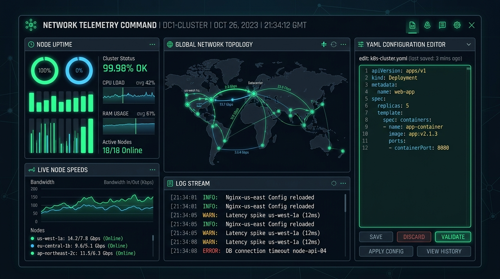
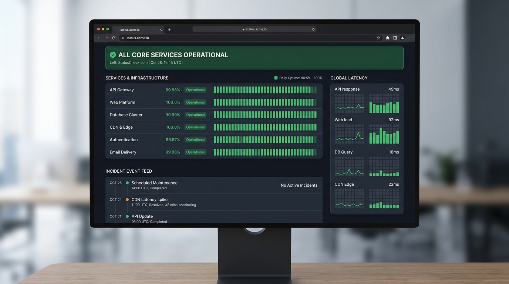

# 📡 Telemetry Pinger

A full-stack, real-time background network prober daemon designed to monitor route availability, latent performance, and HTTP response profiles of distributed systems. It features hot-reloading YAML configuration profiles, a centralized operational dashboard, robust alerts delivery channels, and a dynamically compiled public Status Page sheet.

---

## 📸 Interface Preview

### Core Telemetry Console
*A unified operational hub to review microservice statuses, edit daemon profiles, dry-run alerts broadcast, and track chronological incident feeds.*



### Dynamically Compiled Status Page
*The standalone, portable, client-side offline-compliant HTML Status Board. Fully custom-styled and outputted dynamically by the daemon with embedded performance tickers.*



---

## ⚡ Key Architectural Modules

1. **Active Core Daemon**: Server-side continuous loop clock running on an in-memory scheduler. Seamlessly executes concurrent pings using `fetch` streams, evaluates expected HTTP status configurations, calculates rolling uptime trends, and logs responses.
2. **YAML Orchestrator**: Leverages structural `hosts.yaml` schema files to manage rules. Fully hot-swappable: changes made via the GUI configuration editor are evaluated, validated, committed back to file, and trigger instant daemon rescheduled intervals without service interruptions.
3. **Multi-Channel Alarms Core**: Dynamic webhooks payload formatter. Dispatches structured **Slack Block Kit** notifications or high-fidelity **Discord Embed Cards** with color-coded warning icons, latency metrics, and details.
4. **Standalone Status Page Compiler**: Continuously writes a lightweight, dependency-free, modern static `status.html` page into server directories. Users can view the live HTML page or download the complete standalone sheet instantly.

---

## ⚙️ Configuration Schema (`hosts.yaml`)

Specify probe speeds, webhook destinations, and target nodes in your local configuration block:

```yaml
config:
  interval_seconds: 10          # Speed of background querying loops
  timeout_seconds: 5            # Abort request window for sluggish endpoints
  webhook:
    enabled: true               # Active toggle for communications
    url: "https://discord.com/api/webhooks/YOUR_WEBHOOK_URL"
    alert_on_status_change: true # Notify on OUTAGE & RECOVERY transitions
    alert_on_latency_spike: true # Notify if latency exceeds threshold metric
    latency_threshold_ms: 800    # Latency limit trigger (ms)

hosts:
  - id: google
    name: Google Core Services
    url: https://www.google.com
    expected_status: 200        # Response checklist validation
  - id: github
    name: GitHub Platform
    url: https://github.com
    expected_status: 200
  - id: dev_microservice
    name: Checkout Pipeline Lambda
    url: https://httpbin.org/status/500
    expected_status: 200        # Triggers offline status alert (HTTP 500)
```

---

## 🔌 API Endpoints Reference

The daemon runs an integrated JSON-API server on interface port `3000`:

| Endpoint | HTTP Method | Response / Action |
|--- |---|---|
| `/api/telemetry` | `GET` | Fetches active runtime stats, hosts metrics maps, incident rolling logs, and current daemon parameters. |
| `/api/config` | `GET` | Reads current disk parameters and returns the raw `hosts.yaml` string contents. |
| `/api/config` | `POST` | Validates submitted YAML content, overwrites `hosts.yaml` securely, and hot-boots the background daemon. |
| `/api/test-webhook` | `POST` | Dispatches a diagnostic verification alert message to your configured Slack or Discord endpoint. |
| `/api/force-ping` | `POST` | Instructs the background daemon to immediately sweep all endpoints and update statistics right away. |
| `/api/status-page` | `GET` | Serves the dynamically compiled standalone static HTML Status Page inside the browser. |
| `/api/status-page/download` | `GET` | Returns the compiled `status.html` file as a standalone attachment download. |

---

## 🛠️ Technology Stack & Libraries

- **Backend Platform**: Node.js & Full-stack Express.
- **Frontend SPA Layout**: React 19, Motion (Framer Motion 12), and Lucide Icons.
- **Styling Utility**: Tailwind CSS with sleek custom deep slate themes.
- **Core parsers & compilers**: `js-yaml` parser and compiler module, `esbuild` server compiler.

---

## 🚀 Running locally

### 1. Developer Mode
Runs the active Express daemon proxy server together with the Vite development assets compilation:
```bash
npm run dev
```

### 2. Standalone Production Build
Bundles the React client into minimized statics and compiles the TypeScript server file to a robust `dist/server.cjs` module:
```bash
npm run build
```

### 3. Spawn Standalone Release
Spawns the web server and background daemon using the compiled CommonJS artifact:
```bash
npm run start
```
